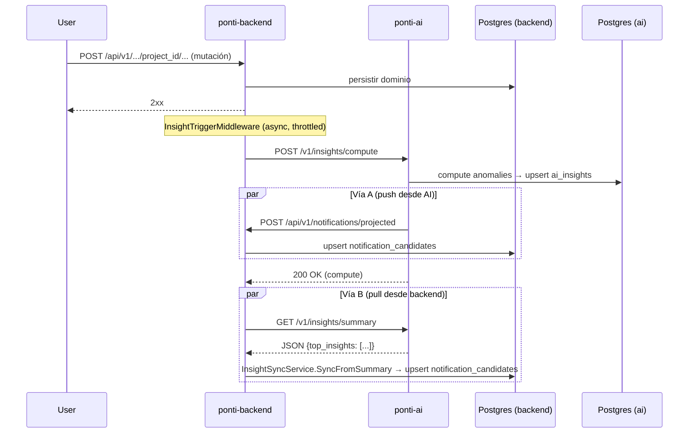

# Evolución del sistema de IA de Ponti

Documento de referencia para la reescritura de ponti-ai alineada con la arquitectura de Pymes.

---

## 1. Estado actual (as-is)

### 1.1 Arquitectura

```
[Browser] → [BFF Express] → [ponti-backend Go] → [ponti-ai FastAPI]
                                                         ↓
                                                   [PostgreSQL ai_*]
```

- **Estructura:** estilo Pymes (`src/api/`, `src/agents/`, `src/insights/`, etc.) — ver §6 "Estado as-is post Fase 10"
- **Runtime:** `devpablocristo-core-ai` (`runtime.*`)
- **LLM:** factory (stub, Gemini, Ollama) según config
- **DB propia:** tablas `ai_conversations`, `ai_project_dossiers`, `ai_insights`, `ai_baselines`, `ai_insight_proposals`

### 1.2 Rutas HTTP

| Módulo | Método | Path | Descripción |
|--------|--------|------|-------------|
| Insights | POST | `/v1/insights/compute` | Computa insights (anomaly_runner) |
| Insights | GET | `/v1/insights/{entity_type}/{entity_id}` | Insights por entidad |
| Insights | GET | `/v1/insights/summary` | Resumen dashboard (top_insights, conteos) |
| Insights | POST | `/v1/insights/{insight_id}/actions` | Registrar acción usuario (ack/snooze/resolved) |
| Copilot | GET | `/v1/copilot/insights/{insight_id}/explain` | Explicación LLM del insight |
| Copilot | GET | `/v1/copilot/insights/{insight_id}/why` | Razón de negocio + evidencia |
| Copilot | GET | `/v1/copilot/insights/{insight_id}/next-steps` | Acciones recomendadas |
| Chat | POST | `/v1/chat` | Turno de chat (JSON) |
| Chat | POST | `/v1/chat/stream` | Turno de chat (SSE streaming) |
| Chat | GET | `/v1/chat/conversations` | Listar conversaciones |
| Chat | GET | `/v1/chat/conversations/{id}` | Detalle de conversación |
| Health | GET | `/healthz`, `/readyz`, `/metrics`, `/v1/version` | Operacional |

### 1.3 Agentes de chat

| Constante | Valor | Rol |
|-----------|-------|-----|
| PRODUCT_AGENT_NAME | `"general"` | Asesor general (default/fallback) |
| COPILOT_AGENT_NAME | `"copilot"` | Handoff desde insights/notificaciones |
| DASHBOARD_AGENT_NAME | `"dashboard"` | Tablero de control |
| LABORS_AGENT_NAME | `"labors"` | Labores agrícolas |
| SUPPLIES_AGENT_NAME | `"supplies"` | Insumos |
| CAMPAIGNS_AGENT_NAME | `"campaigns"` | Campañas |
| LOTS_AGENT_NAME | `"lots"` | Lotes |
| STOCK_AGENT_NAME | `"stock"` | Stock |
| REPORTS_AGENT_NAME | `"reports"` | Reportes |

**Total:** 9 agentes. Routing actual: if/else en `_resolve_route()` sin `RoutingDecision` estructurado.

### 1.4 Tools (25 total)

| Tool | Backend endpoint | Dominio |
|------|-----------------|---------|
| `get_insights_summary` | Local (InsightsService) | Insights |
| `fetch_dashboard` | `/api/v1/dashboard` | Dashboard |
| `fetch_labors_catalog` | `/api/v1/projects/{pid}/labors` | Labores |
| `fetch_labors_grouped` | `/api/v1/labors/group/{pid}` | Labores |
| `fetch_labor_metrics` | `/api/v1/labors/metrics` | Labores |
| `fetch_supplies` | `/api/v1/supplies` | Insumos |
| `fetch_supply_detail` | `/api/v1/supplies/{sid}` | Insumos |
| `fetch_supply_movements` | `/api/v1/projects/{pid}/supply-movements` | Insumos |
| `fetch_lots` | `/api/v1/lots` | Lotes |
| `fetch_lot_detail` | `/api/v1/lots/{lid}` | Lotes |
| `fetch_lot_metrics` | `/api/v1/lots/metrics` | Lotes |
| `fetch_campaigns` | `/api/v1/campaigns` | Campañas |
| `fetch_work_orders` | `/api/v1/work-orders` | OT |
| `fetch_work_order_detail` | `/api/v1/work-orders/{wid}` | OT |
| `fetch_work_order_metrics` | `/api/v1/work-orders/metrics` | OT |
| `fetch_stock_summary` | `/api/v1/projects/{pid}/stocks/summary` | Stock |
| `fetch_stock_periods` | `/api/v1/projects/{pid}/stocks/periods` | Stock |
| `fetch_customers` | `/api/v1/customers` | Clientes |
| `fetch_customer_detail` | `/api/v1/customers/{cid}` | Clientes |
| `fetch_project_detail` | `/api/v1/projects/{pid}` | Proyectos |
| `fetch_projects_list` | `/api/v1/projects` | Proyectos |
| `fetch_data_integrity_costs` | `/api/v1/data-integrity/costs-check` | Integridad |
| `fetch_report_field_crop` | `/api/v1/reports/field-crop` | Reportes |
| `fetch_report_investor_contribution` | `/api/v1/reports/investor-contribution` | Reportes |
| `fetch_report_summary_results` | `/api/v1/reports/summary-results` | Reportes |

### 1.5 Trigger auto-compute (ponti-backend)

`InsightTriggerMiddleware` en `internal/ai/trigger.go`:
- Fires después de POST/PUT/PATCH/DELETE con 2xx
- Requiere `project_id` en la ruta; skip si path contiene `/ai/`
- Throttle por proyecto (default 300s, configurable via `AI_COMPUTE_THROTTLE_SEC`)
- Semáforo concurrente (32 slots)
- Secuencia: POST `/v1/insights/compute` → si OK → GET `/v1/insights/summary` → `SyncFromSummary`

---

## 2. Dos vías de notificaciones

### 2.1 Vía A — Push desde ponti-ai

En `insights.py` → `_project_notifications_if_configured()`:
- Después de compute exitoso
- POST a `/api/v1/notifications/projected` en ponti-backend
- Incluye `chat_context` con `routed_agent: "copilot"`, `suggested_user_message`
- Solo si backend está configurado

### 2.2 Vía B — Pull/sync desde ponti-backend

En `trigger.go` → `syncSummary()` → `InsightSyncService.SyncFromSummary()`:
- Después de compute exitoso (desde el trigger)
- GET `/v1/insights/summary` de ponti-ai
- Parsea `top_insights` → upsert en `ponti_notification_candidates`
- Incluye `RouteHint: "copilot"`, `Payload` con `insight_id`, `entity_type`

### 2.3 Diagrama de secuencia



### 2.4 Decisión: unificar a Vía B (pull/sync)

**Razón:** la Vía A (push) es redundante — el trigger ya hace pull del summary y sincroniza. La Vía A agrega complejidad (HTTP circular) y riesgo de condiciones de carrera.

**Acción (Fase 8):** eliminar `_project_notifications_if_configured` de `insights.py`. Enriquecer `SyncFromSummary` con `chat_context` para handoff.

---

## 3. Auditoría de tools

| Tool | Decisión | Razón |
|------|----------|-------|
| `get_insights_summary` | ✅ Mantener | Core del producto, local |
| `fetch_dashboard` | ✅ Mantener | Tablero principal |
| `fetch_labors_catalog` | ✅ Mantener | Dominio core agro |
| `fetch_labors_grouped` | ✅ Mantener | Costos por OT |
| `fetch_labor_metrics` | ✅ Mantener | Métricas laborales |
| `fetch_supplies` | ✅ Mantener | Dominio core agro |
| `fetch_supply_detail` | ✅ Mantener | Detalle insumos |
| `fetch_supply_movements` | ⚠️ Revisar | Puede truncarse; evaluar si se usa |
| `fetch_lots` | ✅ Mantener | Dominio core agro |
| `fetch_lot_detail` | ✅ Mantener | Detalle lotes |
| `fetch_lot_metrics` | ✅ Mantener | Métricas lotes |
| `fetch_campaigns` | ✅ Mantener | Dominio core agro |
| `fetch_work_orders` | ✅ Mantener | OT |
| `fetch_work_order_detail` | ✅ Mantener | Detalle OT |
| `fetch_work_order_metrics` | ✅ Mantener | Métricas OT |
| `fetch_stock_summary` | ✅ Mantener | Stock core |
| `fetch_stock_periods` | ✅ Mantener | Períodos stock |
| `fetch_customers` | ✅ Mantener | Clientes |
| `fetch_customer_detail` | ✅ Mantener | Detalle clientes |
| `fetch_project_detail` | ✅ Mantener | Contexto proyecto |
| `fetch_projects_list` | ✅ Mantener | Listado proyectos |
| `fetch_data_integrity_costs` | ⚠️ Revisar | Diagnóstico; ¿se usa en chat? |
| `fetch_report_field_crop` | ✅ Mantener | Reportes |
| `fetch_report_investor_contribution` | ✅ Mantener | Reportes |
| `fetch_report_summary_results` | ✅ Mantener | Reportes |

**Resultado:** 23 se mantienen, 2 a revisar durante Fase 3.

---

## 4. Mapping de agentes — naming final

Dado que es reescritura, usamos naming alineado con Pymes desde el inicio. No hay legado que migrar.

| Ponti actual | Nuevo nombre | Razón |
|-------------|-------------|-------|
| `"copilot"` | `"insight_chat"` | Alineado con Pymes; es el carril de insight/handoff |
| `"general"` | `"general"` | Sin cambio |
| `"dashboard"` | `"dashboard"` | Sin cambio (dominio Ponti) |
| `"labors"` | `"labors"` | Sin cambio |
| `"supplies"` | `"supplies"` | Sin cambio |
| `"campaigns"` | `"campaigns"` | Sin cambio |
| `"lots"` | `"lots"` | Sin cambio |
| `"stock"` | `"stock"` | Sin cambio |
| `"reports"` | `"reports"` | Sin cambio |

**Constantes:**
- `COPILOT_AGENT_NAME` → `INSIGHT_CHAT_AGENT_NAME = "insight_chat"`
- `ROUTING_SOURCE_COPILOT_AGENT` → se usa via alias `ROUTING_SOURCE_INSIGHT_CHAT_AGENT` (valor sigue siendo `"copilot_agent"` de core)

**En notificaciones:** `RouteHint: "copilot"` → `RouteHint: "insight_chat"` (en `SyncFromSummary`)

---

## 5. Escenarios de regresión

Cada fase debe verificar que estos escenarios siguen funcionando:

| # | Escenario | Entrada | Esperado |
|---|-----------|---------|----------|
| 1 | Chat libre | `message: "hola"` | Respuesta del asesor general |
| 2 | Hint dominio | `route_hint: "labors"` | Routing a agente labores, tools disponibles |
| 3 | Chat streaming | `POST /v1/chat/stream` | SSE events: start, text, tool_call, done |
| 4 | Copilot explain | `GET /v1/copilot/insights/{id}/explain` | Explicación LLM del insight |
| 5 | Copilot why | `GET /v1/copilot/insights/{id}/why` | Razón + evidencia |
| 6 | Copilot next-steps | `GET /v1/copilot/insights/{id}/next-steps` | Acciones recomendadas |
| 7 | Compute insights | `POST /v1/insights/compute` | Insights creados/actualizados |
| 8 | Insight summary | `GET /v1/insights/summary` | JSON con top_insights |
| 9 | Conversaciones | `GET /v1/chat/conversations` | Lista de conversaciones del user/project |
| 10 | Tool call | `"cuánto stock tengo de urea?"` | LLM llama fetch_stock_summary → responde con datos |
| 11 | Handoff notificación | `handoff` con `insight_id` | Respuesta anclada al insight (nuevo, post Fase 6) |
| 12 | Follow-up anclado | Turn 2 en hilo insight | Evidencia inyectada en prompt (nuevo, post Fase 6) |

---

## 6. Estructura target

```
ponti-ai/
├── src/
│   ├── api/
│   │   ├── router.py              # Chat routes
│   │   ├── chat_contract.py       # DTOs: ChatRequest, ChatResponse, ChatHandoff
│   │   ├── insights_router.py     # Insight routes
│   │   ├── copilot_router.py      # Copilot routes
│   │   └── deps.py                # Dependencies
│   ├── agents/
│   │   ├── catalog.py             # Agent names, normalize_*
│   │   ├── service.py             # run_ponti_orchestrated_chat
│   │   ├── insight_chat_service.py # Insight handoff resolution
│   │   └── audit.py               # record_agent_event
│   ├── routing/
│   │   ├── context.py             # TurnContext
│   │   ├── decision.py            # RoutingDecision
│   │   └── resolve.py             # resolve_routing_decision
│   ├── tools/
│   │   ├── registry.py            # Tool declarations + handlers
│   │   └── ponti_backend.py       # PontiBackendClient
│   ├── insights/                  # Compute, domain, repository
│   ├── copilot/                   # ExplainInsight, explainer
│   ├── db/                        # Models, repository
│   ├── core/                      # Dossier, system_prompt
│   ├── config.py
│   ├── main.py
│   └── runtime_contracts.py
├── migrations/
├── tests/
└── pyproject.toml
```

---

## 7. Fases

| Fase | Nombre | Estado |
|------|--------|--------|
| 0 | Baseline y planificación | Completa |
| 1 | Scaffold: nueva estructura + DB | Completa |
| 2 | Insights + Copilot (portar) | Completa |
| 3 | Chat base (tools + streaming + orquestación) | Completa |
| 4 | Contrato de handoff | Completa |
| 5 | Routing pipeline unificado | Completa |
| 6 | Anclaje de insight + follow-ups | Completa |
| 7 | Frontend: handoff desde notificaciones | Completa |
| 8 | Unificación de notificaciones | Completa |
| 9 | Observabilidad | Completa |
| 10 | Limpieza y cierre | Completa |

---

## 8. Estado as-is post Fase 10

### 8.1 Topología

```
[Browser]
   │
   ▼
[Frontend React (ponti-frontend/ui)]
   │  fetch /v1/...
   ▼
[BFF Express] ──► [ponti-backend Go]
                     │
                     │ (mutación HTTP)
                     ▼
                  [InsightTriggerMiddleware]
                     │ (async, throttled 300s)
                     ▼
                  POST /v1/insights/compute  ──┐
                     │                          │
                     │                          ▼
                     │                       [ponti-ai FastAPI]
                     │                          │
                     │                          ▼
                     │                       [PostgreSQL ai_*]
                     │
                     ▼
                  GET /v1/insights/summary
                     │
                     ▼
                  SyncFromSummary (con chat_context)
                     │
                     ▼
                  [PostgreSQL ponti_notifications]
```

### 8.2 Layout final del repo

```
ponti-ai/
├── src/
│   ├── api/
│   │   ├── router.py              # POST /v1/chat, /v1/chat/stream, GET conversations
│   │   ├── chat_contract.py       # ChatRequest, ChatResponse, ChatHandoff
│   │   ├── insights_router.py     # POST /v1/insights/compute, GET summary, etc.
│   │   ├── copilot_router.py      # GET /v1/copilot/insights/{id}/explain|why|next-steps
│   │   ├── health.py              # /healthz, /readyz, /metrics, /v1/version
│   │   ├── deps.py                # AppContainer, AuthContext, get_container
│   │   └── schemas.py             # InsightItem, SummaryResponse, etc.
│   ├── agents/
│   │   ├── catalog.py             # Agent names + normalize_*
│   │   ├── service.py             # run_ponti_chat_turn, iter_ponti_chat_sse
│   │   ├── insight_chat_service.py # InsightEvidence, build/extract/compact
│   │   └── audit.py               # record_agent_event
│   ├── routing/
│   │   ├── context.py             # TurnContext
│   │   ├── decision.py            # RoutingDecision, HandlerKind
│   │   └── resolve.py             # resolve_routing_decision (5 etapas)
│   ├── tools/
│   │   ├── registry.py            # build_ponti_tool_declarations + handlers
│   │   └── ponti_backend.py       # PontiBackendClient (HTTP read-only)
│   ├── insights/
│   │   ├── domain.py              # Insight, InsightSummary
│   │   ├── service.py             # ComputeInsights, GetInsights, GetSummary, RecordAction
│   │   └── repository.py          # InsightRepositoryPG, AuditLoggerPG
│   ├── copilot/
│   │   ├── service.py             # ExplainInsight use case
│   │   ├── explainer.py           # CopilotExplainerLLM
│   │   ├── insight_planner.py     # InsightPlannerLLM
│   │   ├── tools_catalog.py       # Catálogo de tools del planner
│   │   └── prompts.py             # System prompts versionados
│   ├── core/
│   │   ├── dossier.py             # Project memory + context
│   │   └── system_prompt.py       # Prompt building
│   ├── db/
│   │   ├── models.py              # SQLAlchemy: AIConversation, AIDossier, AIInsight
│   │   └── repository.py          # AIRepository (conversations, dossier)
│   ├── observability/
│   │   └── metrics.py             # Counters, timers
│   ├── config.py                  # Settings (Pydantic)
│   ├── main.py                    # FastAPI app factory + DI
│   └── runtime_contracts.py       # Constants
├── migrations/                    # SQL migrations
├── tests/                         # Solo test_src_*.py (60 tests, 100% pasando)
├── docs/
│   ├── AI_EVOLUTION.md
│   ├── SERVICE_OVERVIEW.md
│   ├── REGRESSION_CHECKLIST.md
│   └── RUNBOOK.md
├── scripts/export_openapi.py
└── pyproject.toml / requirements.txt
```

### 8.3 Diferencias clave vs estado inicial

| Aspecto | Inicio (Fase 0) | Final (Fase 10) |
|---------|----------------|-----------------|
| Estructura | Hexagonal `contexts/` + `adapters/` + `app/` | Pymes `src/{api,agents,routing,...}` |
| Tests | Heredados de hexagonal | 60 tests nuevos (`test_src_*`) |
| Notificaciones | Push desde ponti-ai + sync trigger (dos vías) | Solo sync trigger con `chat_context` (una vía) |
| Routing | Función monolítica `_resolve_route` | Pipeline determinista de 5 etapas |
| Handoff insight | Implícito en chat_context | `ChatHandoff` Pydantic explícito |
| Evidencia insight | No existía | `InsightEvidence` con TTL 24h |
| Frontend handoff | No existía | sessionStorage bridge `notificationChatHandoff.ts` |
| Observabilidad | 1 log básico | 3 logs ricos (`routing_decision`, `turn_summary`, `evidence_injected`) + audit event |
| Documentación | AI_EVOLUTION.md (intent) | + SERVICE_OVERVIEW + REGRESSION_CHECKLIST + RUNBOOK |

